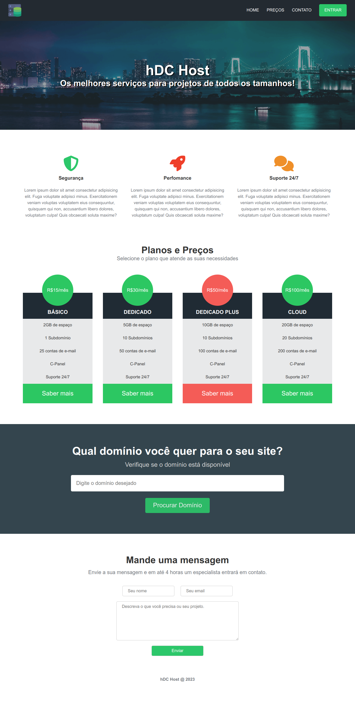

# Website hDC Host

Bem-vindo ao projeto hDC Host, um site para um serviço de hospedagem na web fictício. Este projeto apresenta um design de site responsivo e elegante para um serviço de hospedagem. Ele fornece informações sobre os serviços oferecidos, planos de preços, funcionalidade de pesquisa de domínio e um formulário de contato.

## Visão Geral do Projeto

O site hDC Host foi projetado para representar um serviço de hospedagem fictícia e inclui as seguintes seções:

- **Navbar**: Uma barra de navegação responsiva com links para Início, Preços, Contato e um botão "Entrar".

- **Banner Principal**: Um banner visualmente atraente com o logotipo hDC Host, um título e uma breve descrição dos serviços.

- **Serviços**: Informações sobre os recursos e benefícios-chave do serviço de hospedagem, incluindo segurança, desempenho e suporte 24/7.

- **Planos de Preços**: Detalhes sobre os planos de hospedagem disponíveis, incluindo preços, recursos e um botão "Saber mais".

- **Pesquisar Domínio**: Uma seção para os usuários verificarem a disponibilidade de um nome de domínio para seus sites.

- **Formulário de Contato**: Um formulário de contato onde os usuários podem fornecer seu nome, e-mail e uma mensagem para entrar em contato com o serviço.

- **Rodapé**: Um rodapé simples com um aviso de direitos autorais.

## Tecnologias Utilizadas

O projeto utiliza as seguintes tecnologias:

- HTML
- CSS
- Font Awesome para ícones

## Estrutura do Projeto

A estrutura do projeto é simples e inclui os seguintes arquivos e pastas principais:

- `index.html`: O arquivo HTML principal que estrutura o conteúdo do site.
- `style.css`: O arquivo CSS que define os estilos e o layout do site.
- `img/`: Uma pasta contendo ativos de imagens usados no projeto.

## Como Usar

Para visualizar o site localmente ou fazer modificações, siga estas etapas:

1. Clone este repositório em sua máquina local.

## Foto final

